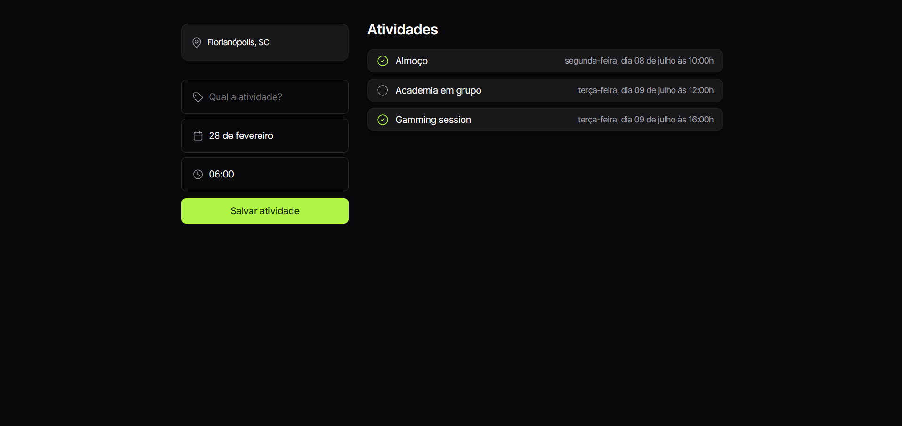

# Projeto NLW Planner

### resumo
Desenvolvimento de um planner de atividades utilizando as ferramentas HTML, JS e CSS. Desenvolvendo toda estruturação, programação e estilos. Na programação verificamos a utilização de objetos, listas, vetores, array e arrow function (pequenas funções). Em CSS vimos seletores importantes para dar forma ao projeto, aplicando suas propiedade e valores.

